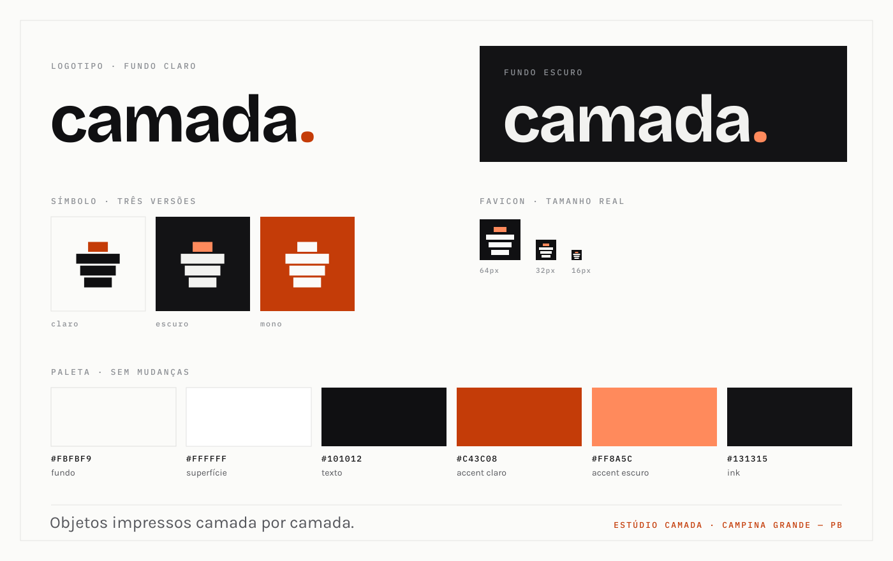

# camada. — manual de marca

Documento de decisão da identidade. Substitui `c3dcriativ` (um @ de Instagram
usado como nome de empresa) e aposenta o codinome `FORMA.` que ainda aparece em
`docs/ART_DIRECTION.md`. A paleta e a tipografia **não mudaram**: já estavam
maduras, testadas em contraste AA e descritas em `app/globals.css`.



---

## 1. O nome

**camada.** — logotipo, sempre em caixa baixa, com o ponto final.
**Estúdio Camada** — uso formal: nota fiscal, contrato, contrato social,
assinatura de e-mail, texto jurídico.

### Por que "camada"

- **É a unidade do produto.** Todo objeto que sai daquela bancada é feito de
  camadas. A voz de copy do site já vivia disso — "47 camadas, cada uma
  inspecionada" (regra A-021 da direção de arte). O nome passa a dizer o que o
  texto já dizia.
- **Uma palavra, três sílabas, português.** Soletra-se sozinha no WhatsApp, que
  é onde a venda acontece de verdade. Sem número, sem sigla, sem inglês.
- **Não tem "3D" dentro.** Se amanhã entrar resina, corte a laser ou cerâmica, o
  nome continua verdadeiro. `c3dcriativ` prendia a empresa a uma tecnologia.
- **O ponto já era de vocês.** `c3dcriativ.` tinha o ponto em cor de argila no
  cabeçalho. É a única equidade visual da marca antiga, e ela atravessa.

### Domínio

`estudiocamada.com.br` — **livre** no registro.br em 17/09/2026 (verificado).
`camada.com.br` é reservado pelo Comitê Gestor e nunca estará disponível.

Outras opções verificadas e livres, caso o nome mude: `estudioaresta.com.br`,
`estudiomalha.com.br`, `estudiobancada.com.br`, `sobrecamada.com.br`.
Registrados por terceiros: `bancada`, `aresta`, `malha`, `camadazero`,
`cotazero`, `camadaestudio`.

---

## 2. O logotipo

`camada` em Bricolage Grotesque 700, tracking `-0.02em`, mais o ponto final em
`--color-accent`. Sempre em texto vivo, nunca em curva: o componente é
`components/brand/logo.tsx`.

```tsx
<Logotipo />                              // cabeçalho da loja
<Logotipo comSimbolo />                   // onde o nome aparece sem contexto
<Logotipo classeDoPonto="!text-[#D68A63]" /> // sobre fundo ink do painel
```

**Não desenhe o logotipo em SVG.** Duas versões do mesmo nome divergem, e a
versão em curva é a que envelhece. Texto é também o que o leitor de tela lê e o
que acompanha o zoom de fonte do navegador.

### Regras

| Regra | Valor |
|---|---|
| Caixa | Sempre baixa. Nunca `CAMADA`, nunca `Camada` |
| Ponto | Obrigatório, sempre em accent. Não é pontuação — é parte do nome |
| Tamanho mínimo | 16px de altura de letra |
| Área de respiro | A altura do "c" em volta dos quatro lados |
| Proibido | Contorno, sombra, gradiente, itálico, esticar, trocar a fonte |

---

## 3. O símbolo

Quatro barras empilhadas cujas larguras (10 · 22 · 18 · 14) traçam o perfil de
um vaso. A barra de cima é a **camada que está sendo impressa agora**: é a única
com cor. É a mesma ideia do cartão "AO VIVO · Nº 001" do hero, reduzida a
geometria.

Raio 0 em todas as barras — é objeto, não interface (regra A-012).

| Arquivo | Uso |
|---|---|
| `public/brand/simbolo.svg` | Fundo claro |
| `public/brand/simbolo-escuro.svg` | Fundo escuro |
| `public/brand/simbolo-mono.svg` | Uma cor só (`currentColor`): gravação, carimbo, bordado, fundo colorido |
| `app/icon.svg` | Favicon — ladrilho ink cheio, porque as barras soltas somem numa aba de tema escuro |

O símbolo lê a 16px. Não o use abaixo disso; abaixo de 16px use só o ladrilho.

---

## 4. Cor

Sem mudanças. A paleta é a **Bancada Colorida** de `app/globals.css`: interface
acromática, e a única cor da tela é foto de produto ou filamento marcando
categoria. É isso que deixa um vaso branco e um dino magenta na mesma fileira
sem que nenhum dos dois pareça deslocado.

| Papel | Claro | Escuro |
|---|---|---|
| Fundo | `#FBFBF9` | `#131315` |
| Superfície | `#FFFFFF` | `#1C1D20` |
| Texto primário | `#101012` | `#F2F2F0` |
| Accent (laranja de bancada) | `#C43C08` | `#FF8A5C` |

**Regra do accent:** no máximo dois elementos em brasa por viewport (A-022). O
ponto do logotipo é um deles.

---

## 5. Tipografia

Sem mudanças, e as três fontes já vêm por `next/font` em `app/layout.tsx`.

- **Bricolage Grotesque** — logotipo e display
- **Karla** — corpo de texto
- **IBM Plex Mono** — preço, medida, prazo, código de pedido. Dado é a
  linguagem visual do produto (A-020)

---

## 6. Voz

Técnico confiante, com número verificável (A-021). O nome reforça isso: uma
marca chamada "camada" não pode escrever "produtos incríveis de alta qualidade".

- Diga: "0,12 mm por camada. 47 camadas. Cada uma inspecionada."
- Não diga: "peças incríveis com qualidade premium"

Assinatura curta: **Objetos impressos camada por camada.**

---

## 7. Checklist da migração

A marca já está aplicada no código. O que falta depende de registro em
serviços externos, e por isso **não** foi trocado — trocar antes de registrar
quebraria canonical, Open Graph e os links do rodapé em produção.

- [ ] Registrar `estudiocamada.com.br` no registro.br
- [ ] Criar o @ no Instagram e migrar o perfil atual (`@c3dcriativ`)
- [ ] Criar `ola@estudiocamada.com.br`
- [ ] Trocar `SITE_URL`, `INSTAGRAM_HANDLE`, `INSTAGRAM_URL` e `CONTACT_EMAIL`
      em `lib/constants.ts`
- [ ] Redirecionar 301 de `c3dcriativ.com.br` para o domínio novo, e mantê-lo
      pago por pelo menos dois anos
- [ ] Atualizar o nome da loja na Shopee e a arte de perfil dos canais
- [ ] Repintar o painel: `components/admin/admin-nav.tsx` ainda usa uma paleta
      quente própria (`#1B1A15`, `#EDE6D7`, `#D68A63`), herdada da identidade
      antiga e já divergente da loja

### Já feito

- `SITE_NAME`, títulos de página, metadata e título do painel
- Componente de logotipo, símbolo em três versões e favicon
- Imagem de compartilhamento em PNG (`public/images/og.png`)
